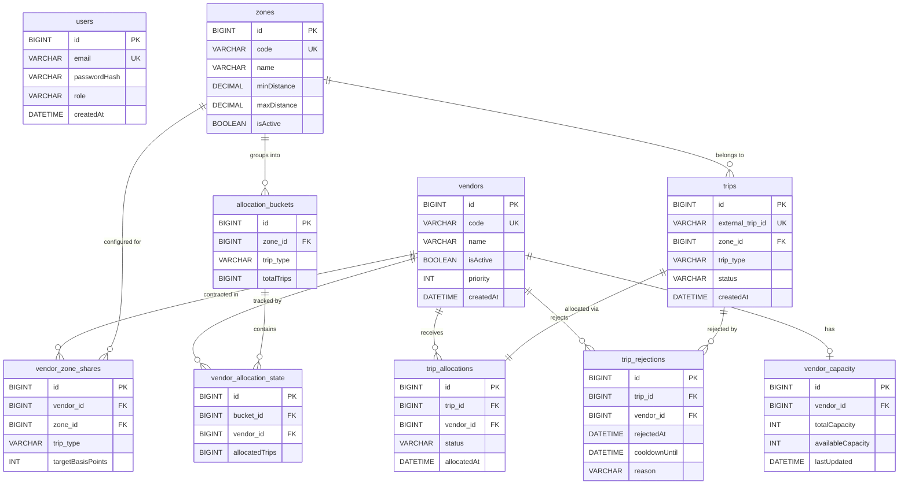

# Database Entity Relationship Diagram

## Entity Relationship Diagram

## Unique Constraints

| Table | Unique Constraint |
|---|---|
| `users` | `email` |
| `vendors` | `code` |
| `zones` | `code` |
| `vendor_zone_shares` | `(vendor_id, zone_id, trip_type)` |
| `allocation_buckets` | `(zone_id, trip_type)` |
| `vendor_allocation_state` | `(bucket_id, vendor_id)` |
| `vendor_capacity` | `vendor_id` (one record per vendor) |
| `trips` | `external_trip_id` |
| `trip_allocations` | `trip_id` (one allocation per trip) |

## Key Relationships

- **`vendor_zone_shares`** — Defines the contracted share (in basis points) for each `Vendor` × `Zone` × `TripType` combination. Shares for the same zone and trip type must sum to exactly 10 000 bp.
- **`allocation_buckets`** — One cumulative counter per `Zone` × `TripType`. Tracks total trips ever allocated in that stream. Never reset.
- **`vendor_allocation_state`** — One row per vendor per bucket. Tracks how many trips that vendor has been allocated in that stream. The shortfall calculation compares this against the bucket total.
- **`vendor_capacity`** — Optional one-to-one with `vendors`. If absent, the vendor is treated as having unlimited capacity.
- **`trip_allocations`** — One-to-one with `trips`. Records which vendor received the trip and the current allocation status (`SUCCESS` / `REJECTED`).
- **`trip_rejections`** — Many-to-one with both `trips` and `vendors`. Each row records a rejection event with a `cooldownUntil` timestamp. The cooldown is scoped to the specific `(vendor, trip)` pair — the vendor remains eligible for other trips.

## Database Source of Truth

MySQL is the authoritative source of truth. Redis is used only as a performance cache for slow-changing configuration data (`vendors`, `zones`, `vendor_zone_shares`). Dynamic allocation state is never cached.
